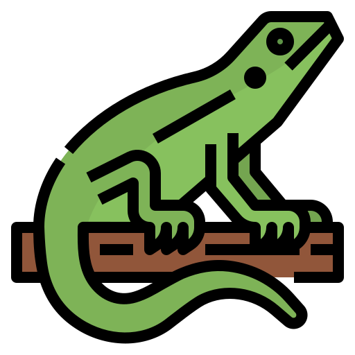

# Calango URL Shortener

**Calango** is a simple, yet powerful URL shortener service built with Golang and Vite + Vue. It provides an easy way to shorten long URLs and manage them effectively.

<p align="center">
  
</p>

## Features

- **URL Shortening**: Convert long URLs into short, easy-to-share links.
- **Custom Short URLs**: Option to create custom short URLs.
- **Analytics**: Track the number of clicks on your shortened URLs (Later...).
- **RESTful API**: Expose a clean and simple API for URL shortening.
- **Frontend**: A responsive web interface built with Vite + Vue for creating and managing short URLs.
- **Database**: Persistent storage of URLs using MongoDB.

## Demo


## Getting Started

### Prerequisites

- [Golang](https://golang.org/) (version 1.18+)
- [Node.js](https://nodejs.org/) (version 16+)
- [MongoDB](https://www.mongodb.com/)

### Installation

1. **Clone the repository**:
    ```bash
    git clone https://github.com/rafaeltiribas/calango.git
    cd calango
    ```

2. **Backend Setup**:
    - Navigate to the `backend` directory:
      ```bash
      cd backend
      ```
    - Install dependencies:
      ```bash
      go mod tidy
      ```
    - Create a `.env` file based on the `.env.example` and update with your MongoDB connection string and other configurations:
      ```bash
      cp .env.example .env
      ```
    - Run the server:
      ```bash
      go run .\main.go .\url_shortener.go
      ```

3. **Frontend Setup**:
    - Navigate to the `frontend` directory:
      ```bash
      cd ../frontend/calango
      ```
    - Install dependencies:
      ```bash
      npm install
      ```
    - Start the development server:
      ```bash
      npm run dev
      ```

### Usage

- **Accessing the Application**: Visit `http://localhost:5173` to access the web interface.
- **API Endpoints**:
    - `POST /calango`: Shorten a new URL.
    - `GET /:shortUrl`: Redirect to the original URL.
    - `GET /api/stats/:shortUrl`: Get analytics for a specific short URL (Later...).

### Configuration

- **Environment Variables**:
   - `MONGODB_URI`: MongoDB connection string.
   - `PORT`: Port for the Golang server.
   - `FRONTEND_URL`: URL of the frontend application (e.g., `http://localhost:5173`).

### Contributing

1. Fork the repository.
2. Create a new branch: `git checkout -b feature/your-feature-name`.
3. Make your changes and commit them: `git commit -m 'Add some feature'`.
4. Push to the branch: `git push origin feature/your-feature-name`.
5. Open a pull request.

### License

Distributed under the MIT License. See `LICENSE` for more information.

### Contact

Rafael Tiribas - [techtiribas@gmail.com](mailto:techtiribas@gmail.com)

Project Link: [https://github.com/rafaeltiribas/calango](https://github.com/rafaeltiribas/calango)

